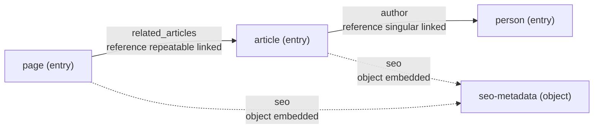

# Visualisation and Diagram Generation

## Why Visualisation Matters

CMMF is easier to review when the model can be seen as a system, not just read as YAML.

Visualisation is useful because it helps teams:

- understand model boundaries quickly
- see embedded structure versus linked relationships
- review content architecture with non-technical stakeholders
- spot over-complex or suspicious modelling patterns early
- create a bridge toward a future visual editor

## Two Useful Output Levels

For now, it is helpful to think about two kinds of visual output:

- lightweight generated diagrams for documentation and quick review
- spatial board outputs for workshops, architecture reviews, and collaborative modelling

These outputs serve different needs and should not be forced into the same format.

## Level 1: Lightweight Diagrams

The simplest useful output is a generated text-based diagram, especially Mermaid.

This is attractive because it is:

- easy to generate from YAML
- easy to store in Git
- easy to embed in Markdown documentation
- readable even before rendering

## Recommended Mermaid Views

### Model Relationship View

This view focuses on model-to-model connections.

It should show:

- each model as a node
- model kind in the label or styling
- `reference` links as directed edges
- `object` embeddings as a distinct edge type or label
- key relationship metadata such as singular versus repeatable, `linked`, or `contained`

Example:

Solid lines can represent references, while dotted lines can represent embedded object structure.

### Field Structure View

This view focuses on a single model and its fields.

It should show:

- the model container
- each field with type
- markers for required fields
- markers for list or relationship behaviour

This is especially useful for onboarding and implementation planning.

### Bounded Context View

This view groups models by domain or area, using tags, folders, or a future grouping concept.

It is useful once the model set grows beyond a handful of files.

## What a Diagram Generator Should Read

A diagram generator should typically use:

- `id`
- `name`
- `kind`
- field `type`
- `objectType`
- `targets`
- `relation`
- optional `tags`

It should usually ignore low-level details such as field help text unless generating a detailed inspection view.

## Visual Semantics Worth Preserving

If diagrams are going to be truly useful, they should preserve a few distinctions clearly:

- `object` versus `reference`
- `linked` versus `contained`
- singular versus repeatable references
- `entry` versus `component` versus `object` versus `taxonomy` versus `settings`
- required versus optional fields in field-level diagrams

These distinctions are more important than pixel-perfect design.

## Suggested Diagram Rules

Good default rules for a first generator:

- render one node per model
- include model `kind` in every node label
- render `reference` fields as directional edges to target models
- label reference edges with repeatability and ownership
- render `object` fields as embedded or dotted edges to the referenced object model
- omit primitive-only fields from the global relationship view
- create one detailed per-model diagram when a full field breakdown is needed

## Example Mermaid Output Strategy

One practical approach is to generate two files:

- a landscape relationship diagram for the full example set
- one per-model field diagram for detailed inspection

That gives teams both overview and depth without making a single diagram unreadable.

## Level 2: FigJam and Miro Board Outputs

Board outputs serve a different purpose from Mermaid.

They are useful for:

- workshops
- collaborative review sessions
- future-state modelling conversations
- stakeholder discussion around ownership, lifecycle, and composition

The goal here is not just to draw a diagram. It is to create a navigable workspace.

## What a Board Generator Should Produce

A FigJam or Miro-oriented generator should produce a board-friendly intermediate output with:

- one card or frame per model
- a visible list of fields for each model
- visual badges for model kind
- connectors for references and embeddings
- metadata chips for repeatable, `contained`, `linked`, and requiredness
- optional grouping by domain, tags, or model kind

## Recommended Board Card Structure

Each model card should usually include:

- model name
- model id
- model kind
- short description when present
- field list with type annotations
- relationship summary

That gives enough detail to support discussion without forcing participants back into raw YAML.

## Board Layout Guidance

Useful defaults:

- place `entry` models in the main flow
- place `object` models near the parents that embed them
- place `taxonomy` models to one side as classification supports
- place `settings` models in a separate configuration lane
- use arrows only for references
- use lighter or nested connectors for embedded objects

This keeps the board readable and aligned with model intent.

## Why a Board Export Should Use an Intermediate Representation

It will be tempting to generate Mermaid, FigJam, and Miro outputs separately from YAML parsing logic. That usually becomes brittle.

A better approach is:

1. parse CMMF into an internal graph representation
2. enrich that graph with visual metadata
3. render multiple targets from that graph

This makes it easier to support:

- Mermaid output
- static SVG or PNG output
- Miro API payloads
- FigJam plugin or import payloads
- a future visual editor

## A Good Intermediate Graph for Visualisation

A useful visual graph would typically include:

- model nodes
- field nodes or field metadata
- edge type such as `reference` or `object`
- edge semantics such as `linked`, `contained`, singular, or repeatable
- grouping metadata such as tags or inferred domains
- optional visual hints such as preferred lane or emphasis

## Future-Proofing for a Visual Editor

If a future visual editor is a likely goal, diagram generation should avoid baking in view-only assumptions.

It is worth designing visual exports so they can eventually support:

- stable model and field identifiers
- round-trippable node metadata
- explicit edge semantics
- layout hints separated from source semantics

That way, the same graph can evolve from "generated documentation" into "editable model workspace."

## Suggested Documentation and Tooling Path

A practical sequence would be:

1. define a visual graph contract derived from CMMF
2. generate Mermaid relationship diagrams from it
3. generate detailed per-model diagrams
4. define a board export shape for FigJam or Miro
5. later build an editor against the same graph contract

## Important Constraint

Visual output should never become the authoritative source of truth.

The authoritative source should remain the CMMF model files. Diagrams and boards should be generated views of that source, even if they eventually become editable interfaces backed by the same underlying model graph.
